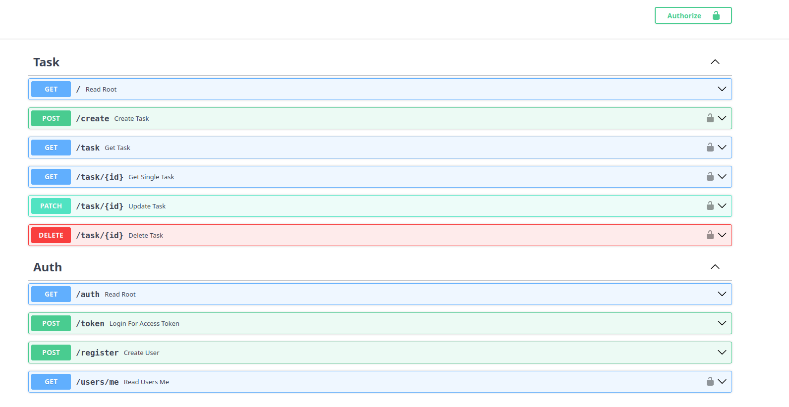

# ToDo List API

This project is a ToDo List API built with FastAPI, allowing users to manage their tasks efficiently. The Authentication is done using JWT tokens. The API provides endpoints for user registration, login, task creation, retrieval, update, and deletion.

## Features

- **User Authentication**: Secure user registration and login functionality.
- **Task Management**: Create, retrieve, update, and delete tasks.
- **User-Specific Data**: Each user has access only to their tasks.

## Screenshots


## Installation

1. **Clone the repository**:

   ```bash
   git clone https://github.com/santoshvandari/todolistapi.git
   cd ToDoListAPI
   ```

2. **Create and activate a virtual environment**:

   ```bash
   python -m venv venv
   source venv/bin/activate  # On Windows: venv\Scripts\activate
   ```

3. **Install the dependencies**:

   ```bash
   pip install -r requirements.txt
   ```

4. **Set up the database**:

   The application uses SQLite. The database will be automatically created when you run the application for the first time.

5. **Set environment variables**:

   Create a `.env` file in the project root and add the following environment variables:

   ```bash
   SECRET_KEY="<Enter your secret key here>"
   ALGORITHM="<Enter your algorithm here>" # This is the algorithm used to sign the JWT token. You Can use HS256, HS384, HS512, RS256, RS384, RS512, ES256, ES384, ES512, PS256, PS384, PS512 and mostly used is HS256
   ACCESS_TOKEN_EXPIRE_MINUTES=30 # This is the time in minutes for which the access token will be valid.
   ```
   Note: You can generate a secret key using the following command:
   ```bash
      openssl rand -hex 32
   ```

## Usage

1. **Run the application**:

   ```bash
   fastapi dev main.py
   ```

2. **Access the API documentation**:

   Open your browser and navigate to `http://127.0.0.1:8000/docs` to view the interactive API documentation.

## API Endpoints

- **User Registration**: `POST /register`
- **User Token**: `POST /token`
- **User Details**: `GET /users/me`
- **User Login**: `POST /login`
- **Create Task**: `POST /tasks/`
- **Get All Tasks**: `GET /tasks/`
- **Get Single Task**: `GET /tasks/{id}`
- **Update Task**: `PATCH /tasks/{id}`
- **Delete Task**: `DELETE /tasks/{id}`

## Testing with Postman

To test the API endpoints with Postman:

1. **Import the API collection**:

   - Create a new collection in Postman.
   - Add requests corresponding to the API endpoints listed above.

2. **Set up authentication**:

   - Register a new user using the `POST /register` endpoint.
   - Log in with the registered user using the `POST /token` endpoint to receive an access token.
   - For endpoints that require authentication, add an `Authorization` header with the value `Bearer <access_token>`.

3. **Test endpoints**:

   - Use the configured requests to interact with the API, ensuring to replace any placeholder values (e.g., `{id}`) with actual data.


## Contributing
We welcome contributions! Feel free to submit a pull request or open an issue if you find bugs or want to add new features. Check out the [Contributing Guidelines](CONTRIBUTING.md) for more information.

## License
This project is licensed under the MIT License. See the [LICENSE](LICENSE) file for details.